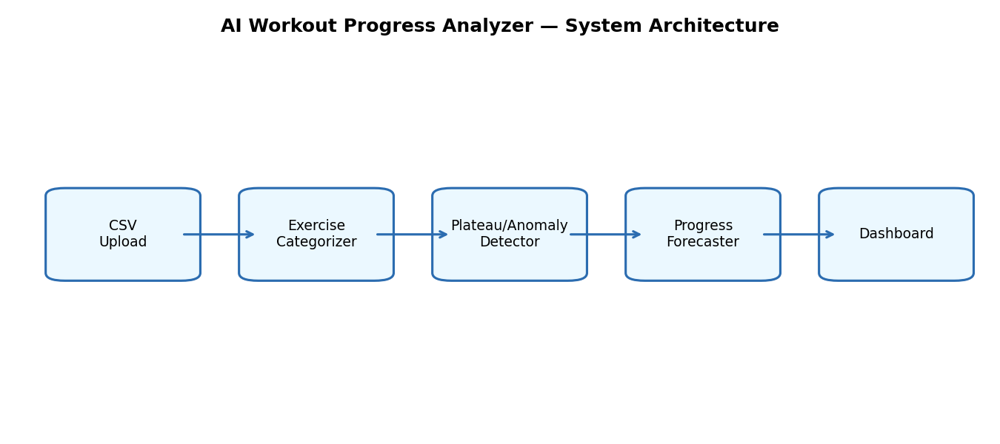
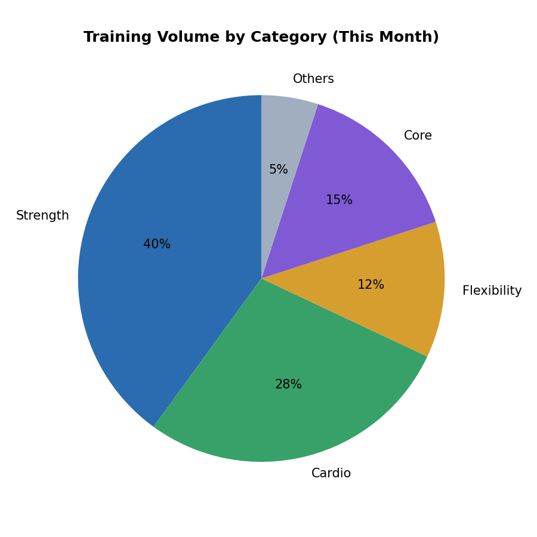
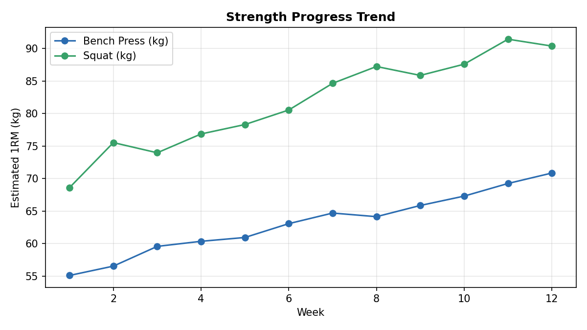
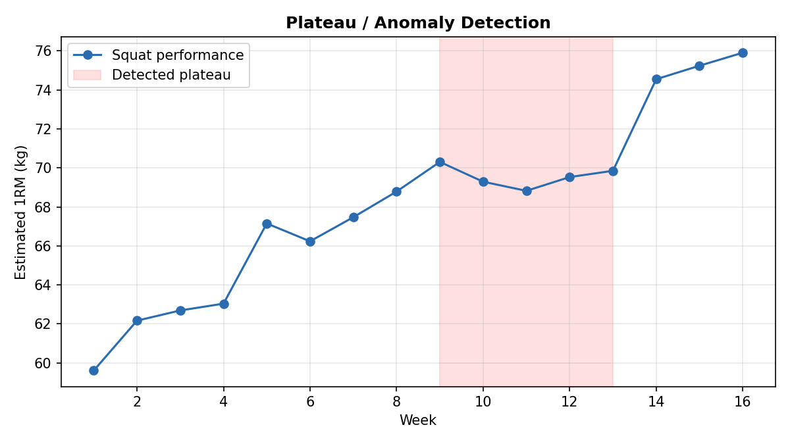
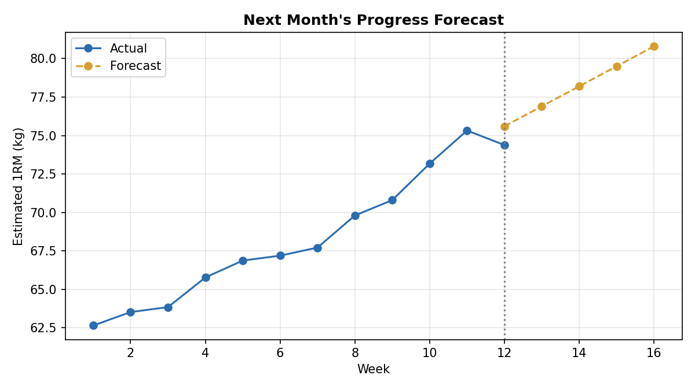

# AI Workout Progress Analyzer

Final project for the Building AI course

## Summary

AI Workout Progress Analyzer automatically reads a workout log CSV, categorizes every exercise (strength, cardio, flexibility, etc.), flags sessions where performance unexpectedly drops or plateaus, and predicts next month's progress — helping people understand their training without manually tracking a single set.

## Background

Most people log workouts but rarely step back to see the bigger picture. Gym trackers and notebooks list raw entries like "Bench Press 3x8 @ 60kg" or "Run 5km 28:40," which tells you nothing about *progress* unless you manually compare weeks of entries yourself.

1. Manually comparing weeks of workout logs is tedious, so most people just... don't, and lose track of whether they're actually improving.
2. A genuine plateau or an unexplained drop in performance (poor sleep, overtraining, an injury creeping in) is easy to miss buried in a long list of sessions.
3. Without visibility into training trends, it's hard to plan next month's program — people keep repeating what isn't working.

This is a problem I've personally run into: finishing a workout, logging it, and having no quick sense of "am I actually getting stronger, or just staying the same?" It's a small annoyance, but it's universal — everyone who trains consistently has this problem, and it's exactly the kind of repetitive, pattern-based task that AI is well suited to remove.

## How is it used?

The intended user is anyone who wants a quick, automatic breakdown of their own training progress, without setting up a spreadsheet or manually tagging every exercise.

1. The user logs into a simple web app and uploads their workout log as a CSV file.
2. The system reads every session, assigns each exercise a category using a hybrid rule-based + machine learning classifier, and checks whether performance (weight, reps, pace, or duration) is unusually low compared to the user's own history for that exercise.
3. The user sees a dashboard: a breakdown of training volume by category, a progress trend line per exercise, a list of flagged plateaus or drops, and a forecast of next month's expected strength/endurance gains.

 

 

(Charts generated from sample data using the project's own categorizer, plateau detector, and forecaster.)

It's meant to be used occasionally — right after a training block or at the end of the week — rather than continuously, and needs no special environment beyond a web browser.

## Data sources and AI methods

The system doesn't use any external dataset — it works directly on the user's own uploaded workout log CSV, so the "data source" is the user's own training history, which is also what makes the predictions personal rather than generic.

For a cold start (a brand-new user with no history yet), exercise names are matched against a small hand-built set of keywords (e.g. "bench," "squat," "run," "yoga") covering common categories, and a lightweight TF-IDF + Logistic Regression classifier acts as a fallback for exercise names the keyword rules don't recognize.

| Method | What it's used for |
| ------ | ------------------- |
| Keyword rules + TF-IDF / Logistic Regression | Categorizing each exercise (Strength, Cardio, Flexibility, etc.) |
| Isolation Forest (with a z-score fallback for small histories) | Flagging unusual performance drops or plateaus |
| Linear regression over per-exercise trends | Predicting next month's progress, overall and per exercise |

## Challenges

1. The categorizer is only as good as its keyword list and small bootstrap training set — an unusual exercise name it hasn't seen will get miscategorized as "Others" rather than genuinely understood.
2. Plateau detection is purely statistical (based on weight/reps/pace), so it can't tell the difference between "plateaued because of overtraining" and "plateaued because of a deliberate deload week."
3. The forecast assumes future progress will follow the same trend as past sessions, which breaks down around irregular events (an injury, illness, or a long break from training).
4. This project doesn't handle wearable/app exports in every format, only a specific CSV structure, which limits it for people using less common trackers.
5. There are real privacy considerations in handling personal fitness data — a production version would need stricter access controls and a clear data-retention policy, none of which this student project implements.

## What next?

1. Add support for importing directly from common fitness apps/wearables, since many people don't keep a manual CSV.
2. Expand the categorizer's training data with real (anonymized) exercise names to improve accuracy on unfamiliar movements.
3. Move from linear regression to a model that accounts for training cycles (e.g. periodization-aware forecasting) once a user has a full year of data.
4. Add goal-setting and alerts (e.g. "you're on track to hit your squat PR goal this month").
5. To get there, I'd benefit from more hands-on practice with time-series forecasting methods and from feedback on real (anonymized) workout log formats to stress-test the parser.

## Acknowledgments

1. Built using open-source tools: Django, Django REST Framework, MongoDB / mongoengine, Streamlit, scikit-learn, pandas, and Plotly.
2. Exercise keyword lists were written by hand based on common exercise names seen in gym and running logs, and are not copied from any proprietary source.
